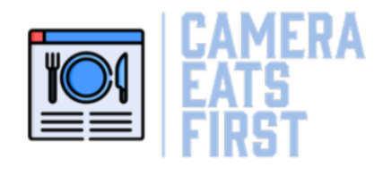
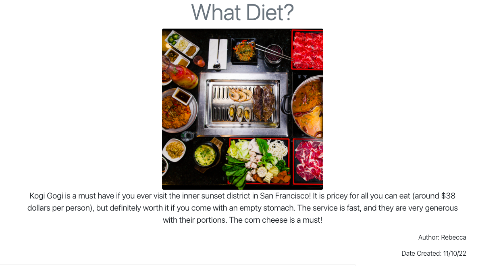
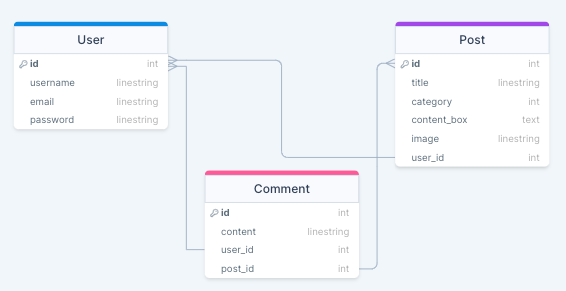

# Camera Eats First 



 Deployed Link : [Check out our project!](https://cameraeatsfirst.herokuapp.com/)

<br>

[](https://opensource.org/licenses/MIT)

<br>

## Description
But first, let me take a food selfie! Camera Eats First is a social media platform specifically for foodies. We realized that there are not a lot of social websites that allow users to create lengthy posts about their meal experiences. Other larger platforms contain subgroups of users that have specific food oriented profiles. We wanted to create a platform where foodies could connect! On Camera Eats First, you don't have to be an influencer to talk about the food you love.


<br>

## Table of Contents

- [Technologies Used](#technologies)
- [Usage](#usage)
- [License](#license)
- [Contributors](#contributors)
- [Questions](#questions)

<br>

## Technologies
- HTML
- CSS
- Javascript
- Bootstrap
- Node
- NPM
- MySQL
- Sequelize
- Bcrypt
- Handlebars
- Cloudinary
- Heroku


<br>

## Usage
First, navigate to our website. You will be presented with a login button, and a display of existing blog post images. You will be able to see all post whether you are logged in or not. Navigate to the Login page and either create a new account or login into an existing account.


Once logged in you will notice that the nav bar options change:


The application uses handlebars to render information depending whether the user is logged in or not.

```handlebars
    {{#if logged_in}}
        <li class="nav-item">
          <a class="nav-link" href="/">Home</a>
        </li>
        <li class="nav-item">
          <a class="nav-link" href="/new-post">New Post</a>
        </li>
        <li class="nav-item">
          <a class="nav-link" id="logout" href="/">Logout</a>
        </li>
        {{else}}
        <li class="nav-item">
          <a class="nav-link" href="/">Home</a>
        </li>
        <li class="nav-item">
          <a class="nav-link" href="/login">Login</a>
        </li>
    {{/if}}
```

However, whether you are logged in or not, you can always just click on an image to be redirected to that specific blog post page!



Be sure to scroll down and see all of the associated comments for that post and if you are looged in, you can even add one of your own!


Now the fun part, posting your food. Make sure you are logged in and click the new post button on the home page or link in the nav bar.


Start creating! Come up with a fun title. Select the cuisine category associated with your blog post. Then start entering you content without any worry about text restrictions. Also you never have to worry about your text captions getting in the way of your food image because you can't see the description until you actually click on the image! By clicking on the image, you will be redirected to the blog page for that specific post. This is rendered using handlebars!

```handlebars
{{#each posts as |post|}}
  <div class="col-sm"><a href="/post/{{post.id}}"></a></div>
  {{/each}}
```

Other notable features (that are present in the backend) is that your password is always encrypted. Your raw password will never be stored in the database because of the Bcrypth NPM package.
The server also uses Sequelize as an ORM to create objects and handle the information in MySQL.

Please reference the image below to see more about how our database and table relationships are structured.




<br>

## License
This application is covered under the [MIT License](https://github.com/SkyWalkerMM26/Food-Blog-Post/blob/main/LICENSE). Please refer to the repo for more information

<br>

## Contributing
Please find each contributors associated LinkedIn and GitHub links underneath their names. Feel free to reach out!

### Ying Ying Liu 

 [](https://www.linkedin.com/in/ying-ying-l-5865a4136/)

[](https://github.com/yingyliu)

<br>
 
 
### Mai Moua

[](https://www.linkedin.com/in/mai-moua-69a50517a/)

[](https://github.com/SkyWalkerMM26)
<br>

<br>
 
 
### Rebecca Overton

[](https://www.linkedin.com/in/rebecca-overton/)

[](https://github.com/overtonr)

<br>

<br>
 
 
### Alexis Zaragoza

[](https://www.linkedin.com/in/alexis-zaragoza-5baa51242/)

[](https://github.com/turtle2001)

<br>

<br>
 
 


<br>

## Questions
If you have any question, please feel free to reach out to each contributor through LinkedIn or GitHub!
